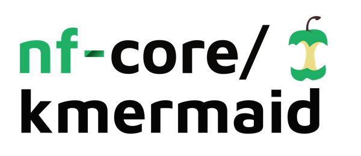

<h1>
  <picture>
    <source media="(prefers-color-scheme: dark)" srcset="docs/images/nf-core-kmermaid_logo_dark.png">
    
  </picture>
</h1>

[](https://github.com/nf-core/kmermaid/actions/workflows/ci.yml)
[](https://github.com/nf-core/kmermaid/actions/workflows/linting.yml)[](https://nf-co.re/kmermaid/results)[](https://doi.org/10.5281/zenodo.XXXXXXX)
[](https://www.nf-test.com)

[](https://www.nextflow.io/)
[](https://docs.conda.io/en/latest/)
[](https://www.docker.com/)
[](https://sylabs.io/docs/)
[](https://cloud.seqera.io/launch?pipeline=https://github.com/nf-core/kmermaid)

[](https://nfcore.slack.com/channels/kmermaid)[](https://twitter.com/nf_core)[](https://mstdn.science/@nf_core)[](https://www.youtube.com/c/nf-core)

## Introduction

**nf-core/kmermaid** is a bioinformatics pipeline that performs comparative analysis of *omes using k-mer based methods. It supports various reference and sequencing input formats, and provides statistics files along with a MultiQC report as output. It provides pre-processing methods for reads and alignments.

<!-- TODO nf-core: Include a figure that guides the user through the major workflow steps. Many nf-core
     workflows use the "tube map" design for that. See https://nf-co.re/docs/contributing/design_guidelines#examples for examples.   -->

In the outline below, every step except for the main analysis is optional and might be input-dependent.

__Optional – BAM preprocessing__

1. Extract BAM from 10X archive (`tar`)
2. Extract FASTQ reads ([`samtools`](http://www.htslib.org/))
3. Split reads per cell (`grep`)
4. Count UMIs per cell ([`pbtk`](https://github.com/PacificBiosciences/pbtk))

5. Download SRA experiment () [optional]

__Optional – read preprocessing__

6. Trim reads ([`fastp`](https://github.com/OpenGene/fastp))
7. Read QC ([`FastQC`](https://www.bioinformatics.babraham.ac.uk/projects/fastqc/))
8. Remove rRNA ([`sortmerna`](https://github.com/sortmerna/sortmerna))
9. Translate to protein ([`orpheum`](https://github.com/czbiohub-sf/orpheum))

__k-mer analysis per method__

10. Create sketch
11. Calculate distances

12. Present the results ([`MultiQC`](http://multiqc.info/))


## Usage

### With a samples.csv file

```bash
nextflow run nf-core/kmermaid --outdir s3://bucket/sub-bucket --samples samples.csv
```

### With R1, R2 read pairs

```bash
nextflow run nf-core/kmermaid --outdir s3://olgabot-maca/nf-kmer-similarity/ \
  --read_pairs 's3://bucket/sub-bucket/*{R1,R2}*.fastq.gz,s3://bucket/sub-bucket2/*{1,2}.fastq.gz'
```

### With SRA ids

```bash
nextflow run nf-core/kmermaid --outdir s3://bucket/sub-bucket --sra SRP016501
```

### With fasta files

```bash
nextflow run nf-core/kmermaid --outdir s3://bucket/sub-bucket \
  --fastas '*.fasta'
```

### With bam file

```bash
nextflow run nf-core/kmermaid  --outdir s3://bucket/sub-bucket \
  --bam 'possorted_genome_bam.bam'
```

### With split kmer

```bash
nextflow run nf-core/kmermaid --outdir s3://bucket/sub-bucket --samples samples.csv --split_kmer --subsample 1000
```

## Credits

nf-core/kmermaid was originally written by Olga Botvinnik. The DSL2 port is done by Igor Trujnara.

We thank the following people for their extensive assistance in the development of this pipeline:

<!-- TODO nf-core: If applicable, make list of people who have also contributed -->

## Contributions and Support

If you would like to contribute to this pipeline, please see the [contributing guidelines](.github/CONTRIBUTING.md).

For further information or help, don't hesitate to get in touch on the [Slack `#kmermaid` channel](https://nfcore.slack.com/channels/kmermaid) (you can join with [this invite](https://nf-co.re/join/slack)).

## Citations

<!-- TODO nf-core: Add citation for pipeline after first release. Uncomment lines below and update Zenodo doi and badge at the top of this file. -->
<!-- If you use nf-core/kmermaid for your analysis, please cite it using the following doi: [10.5281/zenodo.XXXXXX](https://doi.org/10.5281/zenodo.XXXXXX) -->

<!-- TODO nf-core: Add bibliography of tools and data used in your pipeline -->

An extensive list of references for the tools used by the pipeline can be found in the [`CITATIONS.md`](CITATIONS.md) file.

You can cite the `nf-core` publication as follows:

> **The nf-core framework for community-curated bioinformatics pipelines.**
>
> Philip Ewels, Alexander Peltzer, Sven Fillinger, Harshil Patel, Johannes Alneberg, Andreas Wilm, Maxime Ulysse Garcia, Paolo Di Tommaso & Sven Nahnsen.
>
> _Nat Biotechnol._ 2020 Feb 13. doi: [10.1038/s41587-020-0439-x](https://dx.doi.org/10.1038/s41587-020-0439-x).
